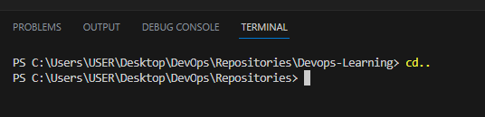

# Linux Project for Commands

## `cd` command

cd means change directory. this command changes your directory to a specified directory or takes you back to the parent directory when used with .. see below image  

